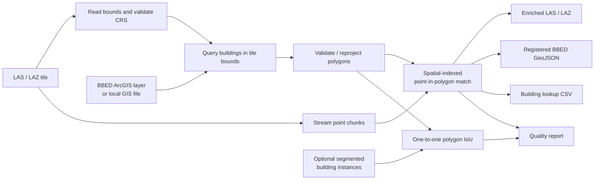
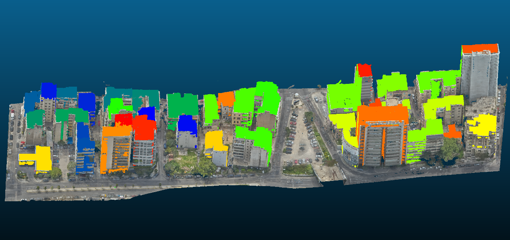
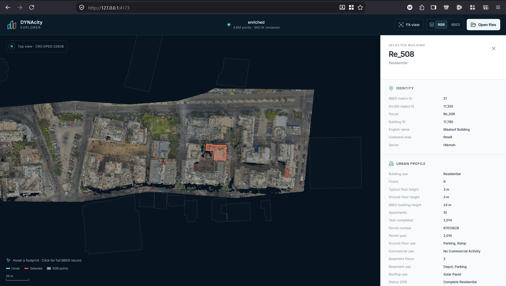
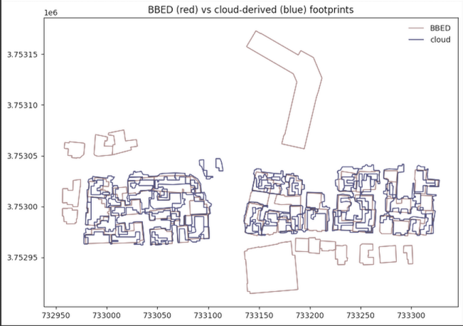

# DYNAcity — BBED ↔ point-cloud correspondence

This branch implements **Task 2** for the DYNAcity character-zone subcase: register the [Beirut Built Environment Database (BBED)](https://storymaps.arcgis.com/stories/bfe80e48487d42a2a82ea061f3c62966) building footprints to the cropped Beirut point cloud and transfer urban attributes to the points.

The pipeline performs real data processing. It is not only a project plan.

## What it does



For every point, the matcher asks which BBED building footprint contains its XY position. The point receives a stable run-local `bbed_id` and selected numeric BBED fields. All original BBED fields—including strings such as parcel ID and building use—remain available in a CSV joined by `bbed_id`.

Matching is processed in chunks, so the full point cloud is never loaded into memory.

## Current data understanding

The following facts were established by the team for the cropped test data:

- Test tile: `TheStreetScape.las`, approximately 125 MB and 4.8 million points.
- Working extent: approximately 369 × 99 m; raw coordinates are around E 733,000 / N 3,753,000 with elevations of 80–144 m.
- The LAS header reportedly contains no CRS metadata. The CRS must therefore be supplied explicitly.
- The point coordinates and BBED building layer use **WGS 84 / UTM zone 36N (`EPSG:32636`)**.
- The BBED basemap footprint service declares `EPSG:32636`. A live query over the presentation's 369 × 99 m extent returns the recorded 55 footprints.
- The full BBED backend contains many unrelated projects. The presentation records nine Beirut layers verified by geographic extent, including buildings, parcels, heritage, zoning/security, and property titles.

## Latest completed Task 2 run (August 2026)

The direct BBED-to-point-cloud pipeline has now been run successfully on
`TheStreetScape.las`. It uses boundary-inclusive 2D point-in-polygon matching:
each LAS point is assigned to the BBED footprint containing its XY coordinate.
If footprints overlap, the smallest footprint wins.

| Result | Completed-run value |
|---|---:|
| Source points | 4,800,668 |
| BBED footprints intersecting the tile | 56 |
| Points assigned to a BBED footprint | 1,599,469 |
| Points outside all BBED footprints | 3,201,199 |
| Matched-point ratio | 33.32% |
| Footprints containing points | 40 of 56 (71.43%) |
| Points inside overlapping footprints | 0 |

The main output in this workspace is
`src/dynacity_bbed/outputs/TheStreetScape/enriched.las`. It preserves the
original point-cloud dimensions and adds the numeric BBED match fields described
below. The complete string and numeric building records are retained in
`building_lookup.csv` and `registered_bbed.geojson`.

This direct enrichment is **not semantic point-cloud segmentation**. It is a
footprint-based assignment: points inside the same BBED polygon receive the same
run-local `bbed_id`, while roads, vegetation, façades outside a footprint, and
other unmatched points retain `bbed_id = -1`.

### BBED attribute completeness

A footprint match does not guarantee that BBED has a complete survey record for
that footprint. The LAS `bbed_id` is a local zero-based link to the lookup table;
it is not the official `BULBuildingID`.

In this run, 35 of the 56 footprints have no usable `NoofFloor` value. Thirty-four
are geometry-only ArcGIS records whose descriptive fields—including parcel ID,
building use, floor count, and building height—are already `null` in the live
BBED source. The pipeline preserves these missing values rather than inventing
them. The interface should therefore describe them as **Missing in BBED source**.
Any height or floor count later derived from the point cloud must be explicitly
labelled as an estimate.

### Mapped BBED-to-point-cloud figure

<!--
Add the final CloudCompare or web-viewer screenshot at:
docs/images/bbed-pointcloud-mapping.png

Recommended content: top view of enriched.las colored by bbed_id, with the BBED
footprint boundaries visible and one selected building's attributes displayed.
-->



### Web viewer

A React/deck.gl interface was added under [`web/`](web/README.md). It provides:

- a locked top-down point-cloud view with pan, zoom, and fit-to-data;
- RGB and BBED-ID point coloring;
- footprint hover summaries;
- click selection with a full BBED and point-cloud statistics sidebar; and
- local LAS/LAZ plus registered-GeoJSON file selection.

For browser performance, the prepared viewer displays 960,134 evenly sampled
points from the 4,800,668-point LAS. This sampling affects only visualization;
the hover polygons and their BBED records remain complete.

<!--
Add the web-interface screenshot at:
docs/images/dynacity-web-viewer.png

Recommended content: the complete desktop interface in top view, with a building
highlighted or selected, its hover summary visible if possible, and the BBED
details sidebar open.
-->



## July 30 experiment recorded in the presentation

The cloud-derived building path was:

1. Estimate ground on a 3 m grid with the 5th-percentile elevation.
2. Remove 465,059 RGB vegetation points using excess green.
3. Keep points over 2.5 m above ground: 1.92 million candidates, or about 40% of the tile.
4. Reject the connected-component result: 0.5 m occupancy cells plus morphological closing merged adjacent façades into only eight blobs.
5. Adopt watershed on roof-height seeds. A seed-spacing sweep produced 105 / 52 / 28 / 12 instances at 4 / 8 / 12 / 18 m; 8 m was selected from area-capture consistency rather than count-matching.

| Result | Presentation value | Interpretation |
|---|---:|---|
| Buildings detected | 41 of 45 in-tile (91%) | Detection is strong on the working tile |
| Mean best-match IoU | 0.234 | Instance boundaries remain weak |
| BBED building area recovered | 76% | Candidate extraction captures most building area |
| BBED buildings per detected instance | 1.58 | Party walls cause merged neighboring buildings |
| Points enriched directly from BBED | 23.7% | Attribute transfer does not depend on watershed quality |



The presentation reports approximately zero mean centroid displacement; applying its median offset changed mean IoU by only 0.003. This supports the conclusion that delineation—not a global XY shift—is the current weakness. These thresholds and results are in-sample. `TheMixedFabric.las` is the stated immediate validation tile, and the real-data figures above still need to be reproduced from committed scripts/configuration before being treated as branch-generated results.

## Installation

Python 3.10 or newer is required.

```powershell
python -m venv .venv
.venv\Scripts\Activate.ps1
python -m pip install -e ".[dev]"
```

LAS, LAZ, GeoJSON, JSON, and Shapefile inputs are supported. LAZ compression is provided by `lazrs` through the declared `laspy[lazrs]` dependency.

## Run Task 2

Place the shared tile under `data/` (this directory and point-cloud formats are ignored by Git), then run:

```powershell
dynacity-bbed run `
  --input data/TheStreetScape.las `
  --point-crs EPSG:32636 `
  --output-dir outputs/TheStreetScape
```

By default, the command queries the public BBED `BuildingLayer_New_forMasar_8_04_2024` basemap layer only for footprints intersecting the tile bounds. This is the layer that reproduces the presentation's 55-footprint query; the separate `Building_BBED2024` layer contains surveyed attributes for only a subset. The client retrieves object IDs first and then downloads explicit batches, avoiding ArcGIS's 2,000-record response limit.

To use a previously downloaded BBED file instead:

```powershell
dynacity-bbed run `
  --input data/TheStreetScape.las `
  --point-crs EPSG:32636 `
  --bbed-source data/BBED_buildings.geojson `
  --bbed-crs EPSG:32636 `
  --output-dir outputs/TheStreetScape
```

`--bbed-crs` is only needed when the local file has no CRS declaration. The pipeline deliberately fails rather than guessing a missing CRS. If an embedded LAS CRS disagrees with `--point-crs`, it also fails.

### Evaluate segmentation instances

If the segmentation stage exports one polygon per predicted building, include it to calculate detection and delineation accuracy:

```powershell
dynacity-bbed run `
  --input data/TheStreetScape.las `
  --point-crs EPSG:32636 `
  --instances data/watershed_building_instances.geojson `
  --instance-crs EPSG:32636 `
  --iou-threshold 0.10 `
  --output-dir outputs/TheStreetScape
```

The evaluator performs one-to-one BBED/prediction matching by polygon IoU and reports precision, recall, F1, mean IoU, and the individual matches. If LAS semantic classes become reliable, repeat `--building-class` to restrict per-building Z/RGB statistics to the selected building classes.

## Outputs

Each run creates:

| File | Purpose |
|---|---|
| `enriched.las` / `enriched.laz` | Original points and dimensions plus BBED match fields |
| `registered_bbed.geojson` | BBED footprints in the point-cloud CRS, enriched with point-derived statistics |
| `building_lookup.csv` | Complete BBED attributes and derived values keyed by `dynacity_match_id` |
| `quality_report.json` | Machine-readable inputs, CRS, coverage, ambiguity, height diagnostics, and optional IoU metrics |
| `quality_report.md` | Short human-readable accuracy summary |

The enriched point cloud adds these numeric LAS dimensions:

| Dimension | Meaning |
|---|---|
| `bbed_id` | Zero-based ID into `building_lookup.csv`; `-1` means no containing building |
| `bbed_oid` | BBED ArcGIS `OBJECTID`; `-1` when unavailable |
| `bbed_bldg` | BBED `BULBuildingID`; `-1` when unavailable |
| `bbed_floors` | BBED floor count; `-1` when unavailable |
| `bbed_h_m` | BBED building height in metres; `NaN` when unavailable |
| `bbed_amb` | Number of containing footprints; values over 1 flag an ambiguous overlap |

LAS extra dimensions cannot safely hold arbitrary-length text. Parcel ID, building use, names, provenance, and other strings therefore remain normalized in the lookup CSV instead of being truncated.

## Accuracy and interpretation

Two different questions must not be conflated:

1. **Attribute-transfer coverage:** how many points fall inside a BBED footprint, and how many footprints contain points? This is always reported.
2. **Registration/delineation accuracy:** how closely independent segmented building instances agree with BBED geometry? This requires `--instances` and is reported with one-to-one polygon IoU.

Having the same EPSG code is necessary, but it does not prove survey alignment. The presentation's centroid-offset test is useful evidence, but a defensible final accuracy report should also use surveyed control points or clearly corresponding roof corners to estimate XY residuals and systematic offset. The point-cloud Z range versus BBED height is included only as an outlier-sensitive diagnostic.

See [the variable audit](docs/variable_audit.md) for the BBED variables, values segmentation can add, and information still missing.

## Development and verification

```powershell
python -m pytest
```

The tests create a synthetic georeferenced LAS tile and building GeoJSON, run the complete chunked pipeline, then verify the point matches, embedded BBED attributes, lookup, registered database, and reports. No project data is committed.

## Data use and attribution

The BBED open layers are published by the Beirut Urban Lab under the Open Database License. Attribute them as requested by the publisher:

> The Beirut Built Environment Database, by the Beirut Urban Lab (American University of Beirut) and Lebanon's National Council for Scientific Research (CNRS).
