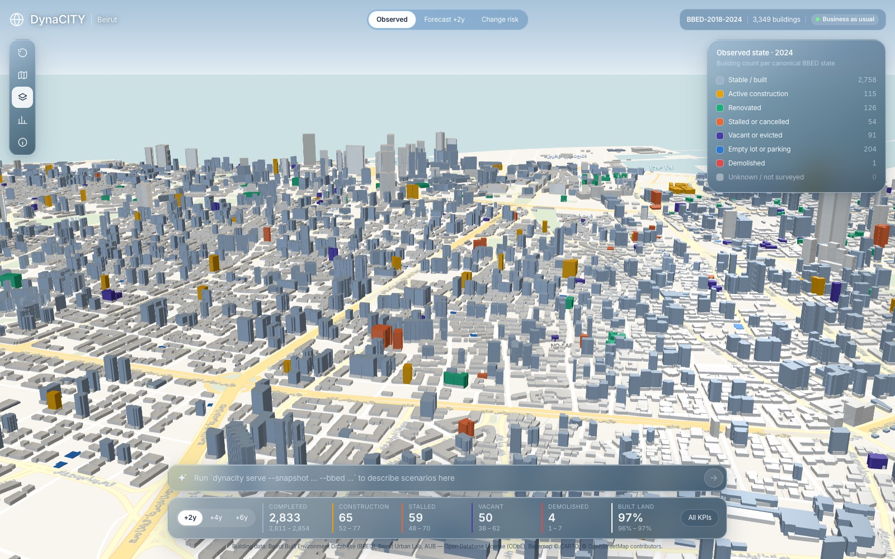
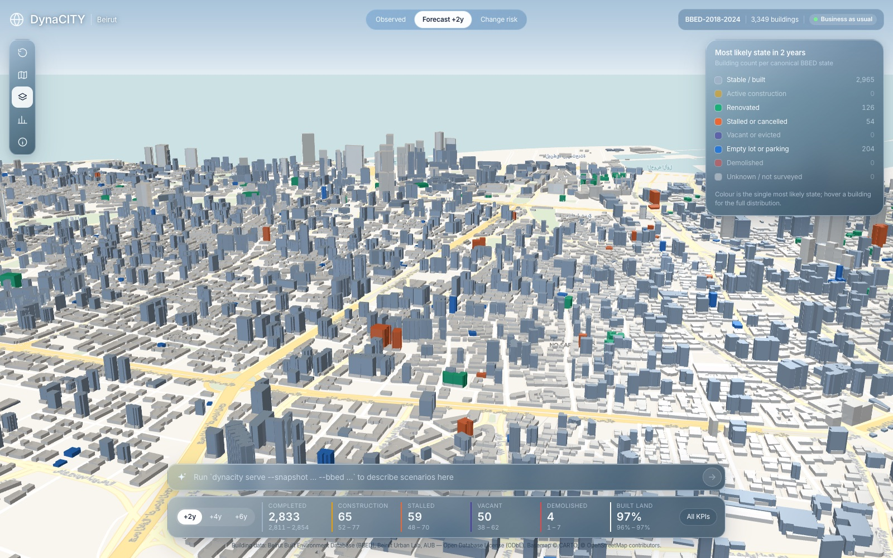
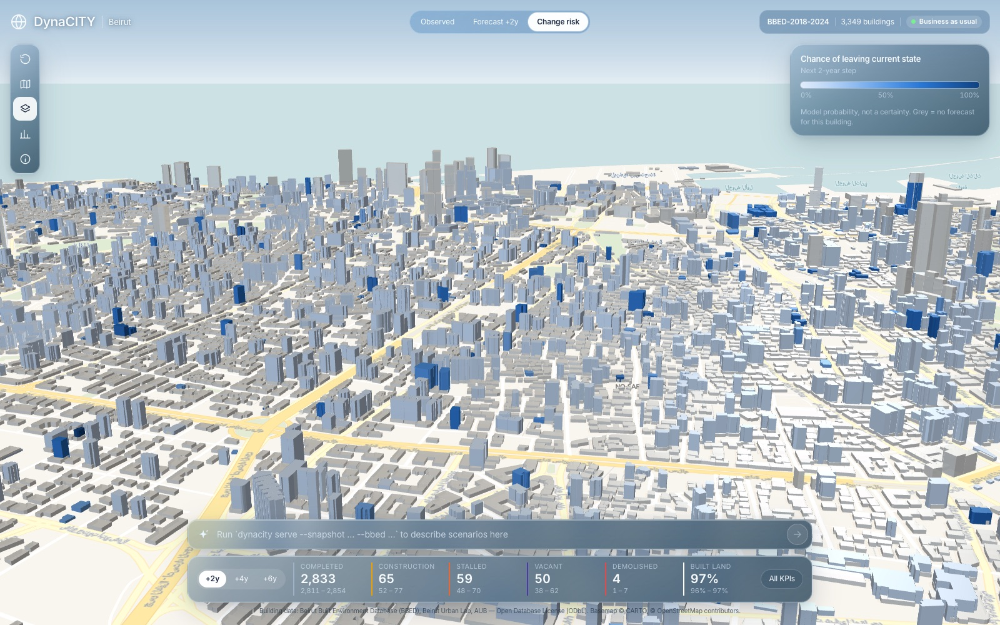
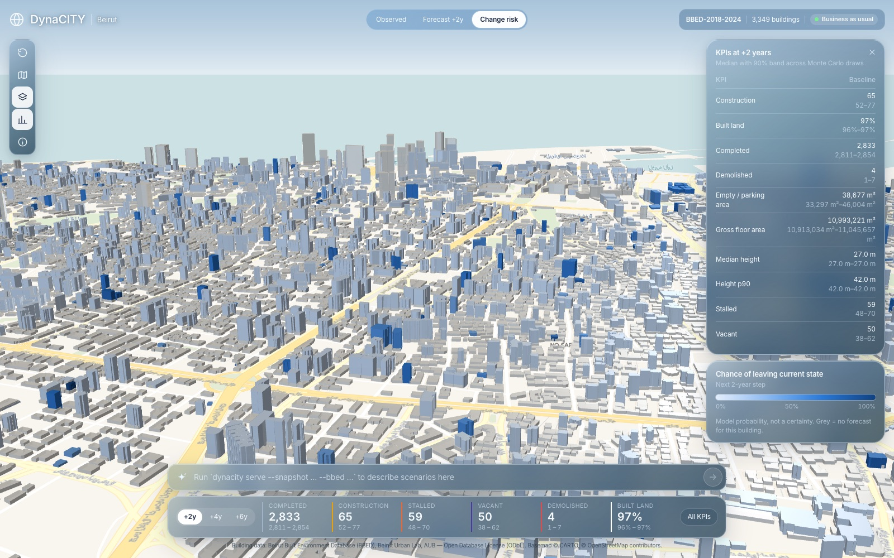
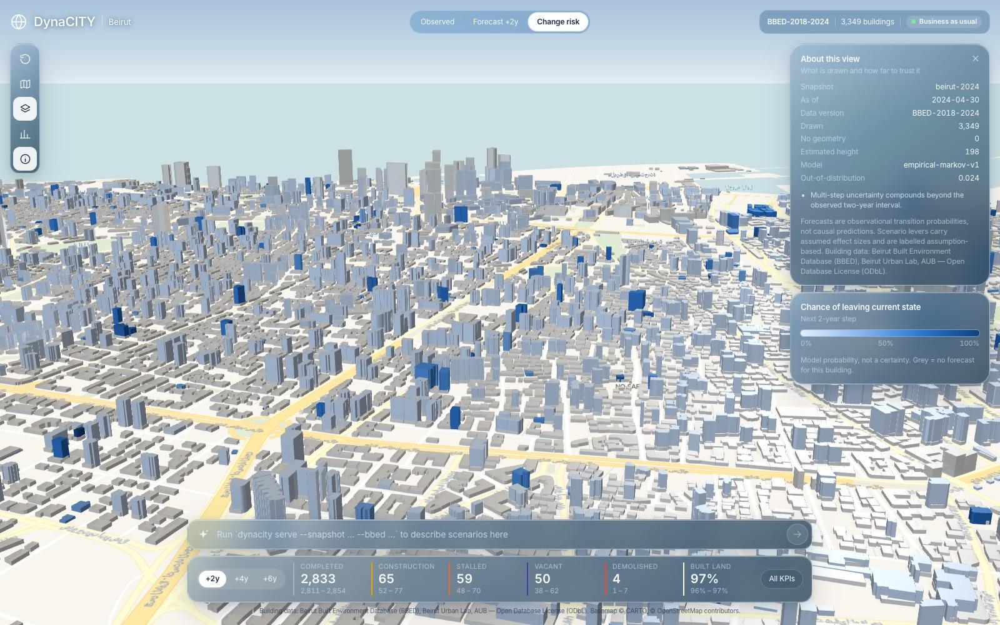
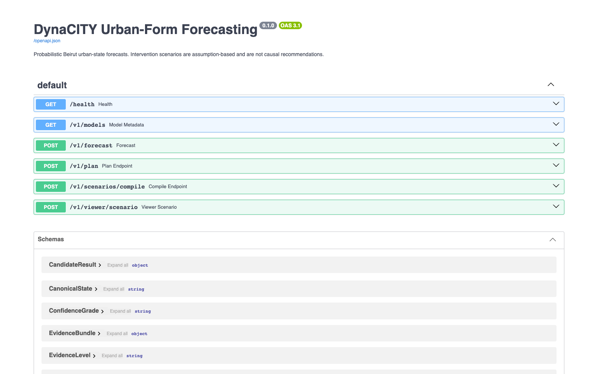

# DynaCITY — Beirut Urban-Form Forecasting

This branch implements the forecasting portion of DynaCITY Task 5.1. Backcasting and reinforcement learning are deliberately out of scope here.

The engine builds a leakage-safe transition panel from the Beirut Built Environment Database (BBED), including a direct descriptive 2018→2024 interval, optionally enriches the 2022→2024 interval with the post-port-blast 2020 AUB point clouds (photogrammetric reconstructions built in Agisoft Metashape and exported to LAS via PDAL — not laser-scanned LiDAR; see [Point-cloud provenance](#point-cloud-provenance)), benchmarks simple and learned transition models, and produces probabilistic 2-, 4-, or 6-year urban-form KPI forecasts.

## Engineering contribution

The core contribution is a versioned urban-state forecasting boundary that combines:

- BBED status transitions from 2018, 2022, and 2024.
- Static morphology and missing-modality indicators from point clouds.
- Explicit temporal-leakage prevention for the 2020 post-blast point-cloud capture.
- Honest baseline/model selection instead of assuming a graph model is superior.
- Monte Carlo KPI trajectories with p05/p50/p95 uncertainty.
- A shared JSON contract, CLI, and FastAPI service.

BBED polygons remain the canonical building boundaries. Point-cloud-derived watershed instances are useful for detection QA, but attached Beirut buildings cannot be reliably split at party walls from geometry alone.

## Screenshots

These come from running the whole pipeline on the public BBED layer (3,349 buildings, snapshot as of 2024-04-30). The benchmark selected the Markov model, and this is the business-as-usual forecast rendered with `dynacity export-viewer`.

| Observed state (2024) | Most likely state in 2 years |
| --- | --- |
|  |  |
| **Chance of leaving the current state** | **All KPIs, p50 with p05–p95 band** |
|  |  |
| **About this view (provenance and OOD score)** | **HTTP API (`dynacity serve`)** |
|  |  |

## Point-cloud provenance

The 2020 point-cloud capture is **photogrammetric (structure-from-motion), not laser-scanned LiDAR**, despite being packaged in `.las` files. Point-level inspection of the source data confirms this: intensity is constant `0` and return number/number-of-returns are always `1` across sampled points — real LiDAR sensors report varying reflectance and, often, multiple returns. The accompanying mesh deliverables carry a glTF `generator` tag of `Agisoft Metashape`, a photogrammetry reconstruction tool; PDAL was used only to export the reconstructed cloud into the `.las` container. Code, CLI flags (`--lidar-features`, `--lidar-year`), and dataframe columns (`lidar_available`, `lidar_acquisition_year`) keep the `lidar` name for continuity with the existing panel/API contract, but functionally they gate on "2020 point-cloud modality available," not on laser LiDAR specifically. The temporal-leakage logic (`panel.assert_no_temporal_leakage`) is unaffected by this distinction — it still correctly forbids the 2020 point-cloud modality from 2018→2022 training rows.

## Private data boundary

Raw LAS/COPC files, BBED downloads, features, trained models, and forecast artifacts are ignored by Git. Set private locations outside the repository:

```powershell
$env:DYNACITY_DATA_ROOT='C:\private\dynacity-data'
$env:DYNACITY_ARTIFACT_ROOT='C:\private\dynacity-artifacts'
```

Only the BBED fields in `dynacity.bbed.BBED_FIELDS` are downloaded. Names, contacts, owner information, and unrelated survey fields are excluded. BBED outputs retain ODbL attribution metadata.

Each object receives a stable composite identity from `BULBuildingID` and ArcGIS `OBJECTID`. This preserves duplicate building IDs and keeps point-cloud features joinable when they were extracted from a spatial subset of the full BBED layer.

## Setup

The recommended environment includes PDAL for safe processing of the multi-gigabyte LAS files:

```powershell
conda env create -f environment.yml
conda activate dynacity-forecasting
```

For the tested lightweight stack:

```powershell
python -m venv .venv
.\.venv\Scripts\Activate.ps1
python -m pip install -e '.[dev]'
```

## Pipeline

1. Inspect LAS metadata without loading the cloud:

   ```powershell
   dynacity inspect-las "C:\path\TheStreetScape.las" --sample-classes 20000
   ```

2. Convert an explicitly hydrated LAS file to COPC. Dry-run first:

   ```powershell
   dynacity build-copc input.las output.copc.laz --dry-run
   dynacity build-copc input.las output.copc.laz
   ```

3. Fetch only the allowlisted BBED fields, optionally limited to a UTM 36N bounding box:

   ```powershell
   dynacity fetch-bbed --bbox 732900 3752900 733400 3753400 --output C:\private\bbed.geojson
   ```

4. Extract BBED-building morphology from the working LAS tile:

   ```powershell
   dynacity extract-features --las TheStreetScape.las --bbed C:\private\bbed.geojson --output C:\private\lidar-features.csv
   ```

5. Build and validate the temporal panel:

   ```powershell
   dynacity build-panel --bbed C:\private\bbed.geojson --lidar-features C:\private\lidar-features.csv --output C:\private\panel.csv
   ```

   The default panel contains 2018→2022 and 2022→2024 modeling rows plus
   direct 2018→2024 rows for descriptive analysis. Generate an auditable summary
   of the direct transition:

   ```powershell
   dynacity summarize-transitions --panel C:\private\panel.csv --start-year 2018 --target-year 2024 --output C:\private\bbed-transitions-2018-2024.json
   ```

6. Run the time-forward benchmark and save the selected model:

   ```powershell
   dynacity train --panel C:\private\panel.csv --output C:\private\forecast.joblib
   ```

7. Build a current snapshot and forecast:

   ```powershell
   dynacity build-snapshot --bbed C:\private\bbed.geojson --snapshot-id beirut-2024 --data-version BBED-2024 --output C:\private\snapshot.json
   dynacity forecast --model C:\private\forecast.joblib --request request.json --output C:\private\forecast.json
   ```

   Or write the scenario in plain language and let the compiler draft and check it. It needs one language-model provider: `pip install -e '.[gemini]'` with `GEMINI_API_KEY` set, or `pip install -e '.[llm]'` with `ANTHROPIC_API_KEY` (pick explicitly with `--provider gemini|anthropic` and `--llm-model`). Keep keys in your environment or keychain, never in the repository:

   ```powershell
   dynacity compile-scenario --snapshot C:\private\snapshot.json --text "Under Law 194/2020, push stalled buildings in Mar Mikhael toward renovation over six years." --output C:\private\compile-report.json --request-output C:\private\request.json
   ```

   Cite curated evidence instead of free text by freezing a registry (see `examples/evidence_registry.example.json`) and passing it to the compiler:

   ```powershell
   dynacity freeze-evidence --registry C:\private\evidence.json --as-of 2024-04-30 --output C:\private\evidence-bundle.json
   dynacity compile-scenario --snapshot C:\private\snapshot.json --text-file scenario.txt --evidence C:\private\evidence-bundle.json --output C:\private\compile-report.json --request-output C:\private\request.json
   ```

8. Backcast and explore trade-offs: give candidate levers, KPI targets, and objectives, and get the least-intervention combinations that meet the targets plus the Pareto front:

   ```powershell
   dynacity plan --model C:\private\forecast.joblib --request plan-request.json --output C:\private\plan.json
   ```

9. Look at it in 3D. Export a static page, or serve it with a live scenario prompt:

   ```powershell
   dynacity export-viewer --bbed C:\private\bbed.geojson --snapshot C:\private\snapshot.json --forecast C:\private\forecast.json --output C:\private-artifacts\viewer.html
   dynacity serve --model C:\private\forecast.joblib --snapshot C:\private\snapshot.json --bbed C:\private\bbed.geojson --evidence C:\private\evidence-bundle.json
   ```

10. Serve the same model through HTTP (`/v1/forecast`, `/v1/plan`, `/v1/scenarios/compile`):

   ```powershell
   dynacity serve --model C:\private\forecast.joblib
   ```

See [the forecasting design](docs/forecasting-engine.md) for the status taxonomy, evaluation gate, API behavior, and limitations.

See [the implementation rationale](docs/implementation-rationale.md) for the full reasoning behind the canonical states, data boundaries, temporal panel, model gate, uncertainty design, interfaces, and current implementation limits.

## Verification

```powershell
pytest
```

The tests use synthetic LAS and BBED fixtures. They do not download or redistribute AUB data.
